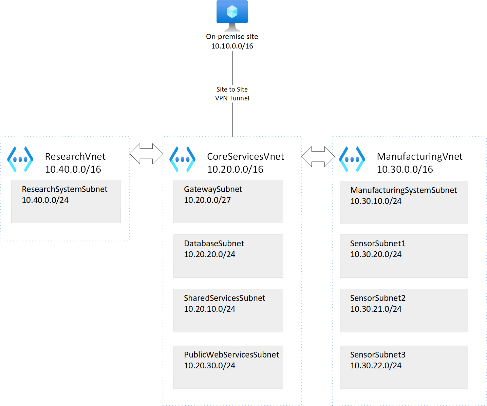

## Lab 1 - Azure VNET Peering and Gateway

### 1. Introduction

In this article we use Azure CLI to create a lab environment. The lab environment has virtual network components and the virtual machines in multiple regions. We use a private DNS zone and VNET peering to test global connectivity between regions.

### 2. Virtual Networks

This diagram shows the virtual network design for the lab exercises.



### 3. Create Resource Group

```
$location="NorthEurope"
$resource_group_name="rg-az700-cli"

az group create --location $location --name $resource_group_name
```

### 4. Create VNETs and subnets

```
# Deploy Research VNET
$vnet_name="ResearchVnet"
$location="SouthEastAsia"
$resource_group_name="rg-az700-cli"
$address_prefixes="10.40.0.0/16"
$subnet_name="ResearchSystemSubnet"
$subnet_prefixes="10.40.0.0/24"

az network vnet create --name $vnet_name `
   --resource-group $resource_group_name `
   --address-prefixes $address_prefixes `
   --subnet-name $subnet_name `
   --subnet-prefixes $subnet_prefixes `
   --location $location

# Deploy Core VNET
$vnet_name="CoreServicesVnet"
$location="EastUS"
$resource_group_name="rg-az700-cli"
$address_prefixes="10.20.0.0/16"
$subnet_name="GatewaySubnet"
$subnet_prefixes="10.20.0.0/27"

az network vnet create --name $vnet_name `
   --resource-group $resource_group_name `
   --address-prefixes $address_prefixes `
   --subnet-name $subnet_name `
   --subnet-prefixes $subnet_prefixes `
   --location $location

# Deploy Datbase Subnet
$subnet_name="DatabaseSubnet"
$subnet_prefixes="10.20.20.0/24"

az network vnet subnet create --name $subnet_name `
   --address-prefixes $subnet_prefixes `
   --vnet-name $vnet_name `
   --resource-group $resource_group_name 

# Deploy Shared Services Subnet
$subnet_name="SharedServicesSubnet"
$subnet_prefixes="10.20.10.0/24"

az network vnet subnet create --name $subnet_name `
   --address-prefixes $subnet_prefixes `
   --vnet-name $vnet_name `
   --resource-group $resource_group_name

# Deploy Public Web Services Subnet
$subnet_name="PublicWebServiceSubnet"
$subnet_prefixes="10.20.30.0/24"

az network vnet subnet create --name $subnet_name `
   --address-prefixes $subnet_prefixes `
   --vnet-name $vnet_name `
   --resource-group $resource_group_name

# Deploy Manufacturing VNET
$vnet_name="ManufacturingVnet"
$location="WestEurope"
$resource_group_name="rg-az700-cli"
$address_prefixes="10.30.0.0/16"
$subnet_name="ManufacturingSystemSubnet"
$subnet_prefixes="10.30.10.0/24"

az network vnet create --name $vnet_name `
   --resource-group $resource_group_name `
   --address-prefixes $address_prefixes `
   --subnet-name $subnet_name `
   --subnet-prefixes $subnet_prefixes `
   --location $location

# Deploy SensorSubnet1
$subnet_name="SensorSubnet1"
$subnet_prefixes="10.30.20.0/24"

az network vnet subnet create --name $subnet_name `
   --address-prefixes $subnet_prefixes `
   --vnet-name $vnet_name `
   --resource-group $resource_group_name

# Deploy SensorSubnet2
$subnet_name="SensorSubnet2"
$subnet_prefixes="10.30.21.0/24"

az network vnet subnet create --name $subnet_name `
   --address-prefixes $subnet_prefixes `
   --vnet-name $vnet_name `
   --resource-group $resource_group_name

# Deploy SensorSubnet3
$subnet_name="SensorSubnet3"
$subnet_prefixes="10.30.22.0/24"

az network vnet subnet create --name $subnet_name `
   --address-prefixes $subnet_prefixes `
   --vnet-name $vnet_name `
   --resource-group $resource_group_name

# Deploy Gateway Subnet
$subnet_name="GatewaySubnet"
$subnet_prefixes="10.30.23.0/27"
$vnet_name="ManufacturingVnet"

az network vnet subnet create --name $subnet_name `
   --address-prefixes $subnet_prefixes `
   --vnet-name $vnet_name `
   --resource-group $resource_group_name

```

### 5. Create Private DNS Zone and Private Links

```
$resource_group_name="rg-az700-cli"
$dns_zone_name="Contoso.com"

# Note private DNS is a global service, no location is specified
az network private-dns zone create --resource-group $resource_group_name `
   --name $dns_zone_name

# Link core service vnet set to auto registration
$private_link_name="CoreServiceVnetLink"
$registration_enable='true'
$resource_group_name="rg-az700-cli"
$dns_zone_name="Contoso.com"
$vnet_name="CoreServicesVnet"

az network private-dns link vnet create --name $private_link_name `
    --registration-enable $registration_enable `
    --resource-group $resource_group_name `
    --virtual-network $vnet_name `
    --zone-name $dns_zone_name


# Link Manufacturing vnet to auto registration
$private_link_name="ManufacturingVnetLink"
$registration_enable='true'
$resource_group_name="rg-az700-cli"
$dns_zone_name="Contoso.com"
$vnet_name="ManufacturingVnet"

az network private-dns link vnet create --name $private_link_name `
    --registration-enable $registration_enable `
    --resource-group $resource_group_name `
    --virtual-network $vnet_name `
    --zone-name $dns_zone_name

# Link Research vnet to auto registration
$private_link_name="ResearchVnetLink"
$registration_enable='true'
$resource_group_name="rg-az700-cli"
$dns_zone_name="Contoso.com"
$vnet_name="ResearchVnet"

az network private-dns link vnet create --name $private_link_name `
    --registration-enable $registration_enable `
    --resource-group $resource_group_name `
    --virtual-network $vnet_name `
    --zone-name $dns_zone_name

```

### 6. Virtual Machines

Following the instructions in the article to [deploy virtual machines](virtual-machines.md). Once, you have deployed your virtual machines, please return back to this article to use peering to connect each virtual network.

### 7. Create Global Peering between CoreServices and Manufacturing VNETs

```
$name="CoreServicesVnet-to-ManufacturingVnet"
$remote_vnet="ManufacturingVnet"
$resource_group_name="rg-az700-cli"
$vnet_name="CoreServicesVnet"

az network vnet peering create `
   --name $name `
   --remote-vnet $remote_vnet `
   --resource-group $resource_group_name `
   --vnet-name $vnet_name `
   --allow-forwarded-traffic `
   --allow-vnet-access

$name="ManufacturingVnet-to-CoreServicesVnet"
$remote_vnet="CoreServicesVnet"
$resource_group_name="rg-az700-cli"
$vnet_name="ManufacturingVnet"

az network vnet peering create `
   --name $name `
   --remote-vnet $remote_vnet `
   --resource-group $resource_group_name `
   --vnet-name $vnet_name `
   --allow-forwarded-traffic `
   --allow-vnet-access

```

### 8. Test 

Use the ssh client and the public IP addresses of each virtual machine to remotely connect to each machine:

```
ssh -i '~/.ssh/id_rsa' azureuser@<publicipvirtualmachine>
```

Once, connected try to ping using the private IP address of a machime. You can retrieve the private IP address for either the Azure portal or by running this command in Linux:

```
ip a show eth0
```

Your test would look like this:

```
# From EastUS VM (testvm1) (ssh client)
ping 10.30.10.4
# Should receive a reply
ping testvm3.contoso.com
# Should use the private DNS zone and resolve to 10.30.10.4

# From WestEurope VM (testvm3) (ssh client)
ping 10.20.20.4
# Should receive a reply
ping testvm1.contoso.com
# Should use the private DNS zone and resolve to 10.20.20.4
```

### 9. Conclusion 

This article has provided the Azure CLI commands to deploy:

1, Networking in multi-region
2, Virtual machines in East US and West Europe
3, Configured a Private DNS zone
4, Enabled global peering between East US and West Europe
