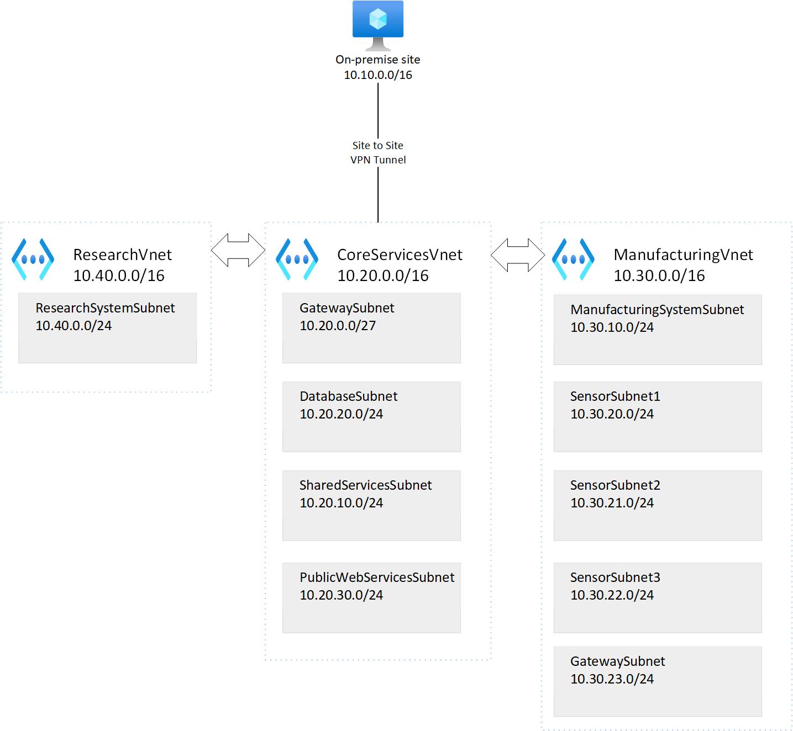

## Lab 3 - Azure VWAN

### 1. Introduction
In this article we use Azure CLI to create a lab environment. The lab environment has virtual network components and virtual machines in multiple regions. We are going to deploy VWAN and then test connectivity between regions.

### 2. Virtual Networks

This diagram shows the virtual network design for all the lab exercises.



> If you have deleted the resource group and virtual networks from lab 1. You will need to repeat steps 3 and 4. If the resources already exist, you can skip to step 5.

### 3. Create Resource Group

```
$location="NorthEurope"
$resource_group_name="rg-az700-cli"

az group create --location $location --name $resource_group_name
```

### 4. Create VNETs and subnets

```
# Deploy Research VNET
$vnet_name="ResearchVnet"
$location="SouthEastAsia"
$resource_group_name="rg-az700-cli"
$address_prefixes="10.40.0.0/16"
$subnet_name="ResearchSystemSubnet"
$subnet_prefixes="10.40.0.0/24"

az network vnet create --name $vnet_name `
   --resource-group $resource_group_name `
   --address-prefixes $address_prefixes `
   --subnet-name $subnet_name `
   --subnet-prefixes $subnet_prefixes `
   --location $location

# Deploy Core VNET
$vnet_name="CoreServicesVnet"
$location="EastUS"
$resource_group_name="rg-az700-cli"
$address_prefixes="10.20.0.0/16"
$subnet_name="GatewaySubnet"
$subnet_prefixes="10.20.0.0/27"

az network vnet create --name $vnet_name `
   --resource-group $resource_group_name `
   --address-prefixes $address_prefixes `
   --subnet-name $subnet_name `
   --subnet-prefixes $subnet_prefixes `
   --location $location

# Deploy Datbase Subnet
$subnet_name="DatabaseSubnet"
$subnet_prefixes="10.20.20.0/24"

az network vnet subnet create --name $subnet_name `
   --address-prefixes $subnet_prefixes `
   --vnet-name $vnet_name `
   --resource-group $resource_group_name 

# Deploy Shared Services Subnet
$subnet_name="SharedServicesSubnet"
$subnet_prefixes="10.20.10.0/24"

az network vnet subnet create --name $subnet_name `
   --address-prefixes $subnet_prefixes `
   --vnet-name $vnet_name `
   --resource-group $resource_group_name

# Deploy Public Web Services Subnet
$subnet_name="PublicWebServiceSubnet"
$subnet_prefixes="10.20.30.0/24"

az network vnet subnet create --name $subnet_name `
   --address-prefixes $subnet_prefixes `
   --vnet-name $vnet_name `
   --resource-group $resource_group_name

# Deploy Manufacturing VNET
$vnet_name="ManufacturingVnet"
$location="WestEurope"
$resource_group_name="rg-az700-cli"
$address_prefixes="10.30.0.0/16"
$subnet_name="ManufacturingSystemSubnet"
$subnet_prefixes="10.30.10.0/24"

az network vnet create --name $vnet_name `
   --resource-group $resource_group_name `
   --address-prefixes $address_prefixes `
   --subnet-name $subnet_name `
   --subnet-prefixes $subnet_prefixes `
   --location $location

# Deploy SensorSubnet1
$subnet_name="SensorSubnet1"
$subnet_prefixes="10.30.20.0/24"

az network vnet subnet create --name $subnet_name `
   --address-prefixes $subnet_prefixes `
   --vnet-name $vnet_name `
   --resource-group $resource_group_name

# Deploy SensorSubnet2
$subnet_name="SensorSubnet2"
$subnet_prefixes="10.30.21.0/24"

az network vnet subnet create --name $subnet_name `
   --address-prefixes $subnet_prefixes `
   --vnet-name $vnet_name `
   --resource-group $resource_group_name

# Deploy SensorSubnet3
$subnet_name="SensorSubnet3"
$subnet_prefixes="10.30.22.0/24"

az network vnet subnet create --name $subnet_name `
   --address-prefixes $subnet_prefixes `
   --vnet-name $vnet_name `
   --resource-group $resource_group_name

# Deploy Gateway Subnet
$subnet_name="GatewaySubnet"
$subnet_prefixes="10.30.23.0/27"
$vnet_name="ManufacturingVnet"

az network vnet subnet create --name $subnet_name `
   --address-prefixes $subnet_prefixes `
   --vnet-name $vnet_name `
   --resource-group $resource_group_name

```

> If you have deleted the virtual machines from lab 1. You will need to repeat step 5. If the virtual machines already exist, you can skip to step 6.

### 5. Virtual Machines

Following the instructions in the article to [deploy virtual machines](virtual-machines.md). Once, you have deployed your virtual machines, please return back to this article to continue to deploy your virtual network gateways.


### 6. Deploy VWAN

```
# Deploy resource to contain vwan
$location="EastUS"
$resource_group_name="rg-az700-cli-vwan"

az group create --location $location --name $resource_group_name


# Deploy vwan

$location="EastUS"
$resource_group_name="rg-az700-cli-vwan"
$name="ContosoVirtualWAN"
$type="Standard"

az network vwan create `
     --name $name `
     --resource-group $resource_group_name `
     --location $location `
     --type $type

# Deploy Hub

$location="WestUS"
$name=ContosoVirtualWANHub-WestUS
$address_prefixes="10.60.0.0/24"
$vhub_name="ContosoVirtualWAN"

az network vhub connection create `
     --name $name `
     --location $location `
     --address-prefixes $address_prefixes `
     --vhub-name $vhub_name `
     


```

### 7. Test

Use the ssh client and the public IP addresses of each virtual machine to remotely connect to each machine:

```
ssh -i '~/.ssh/id_rsa' azureuser@<publicipvirtualmachine>
```

Once, connected try to ping using the private IP address of a machime. You can retrieve the private IP address for either the Azure portal or by running this command in Linux:

```
ip a show eth0
```

Your test would look like this:

```
# From EastUS VM (testvm1) (ssh client)
ping 10.30.10.4
# Should receive a reply
ping testvm3.contoso.com
# Should use the private DNS zone and resolve to 10.30.10.4

# From WestEurope VM (testvm3) (ssh client)
ping 10.20.20.4
# Should receive a reply
ping testvm1.contoso.com
# Should use the private DNS zone and resolve to 10.20.20.4
```

### 8. Tidy Up

Once you have finished testing the connection between regions, you can delete the resources using the following commands:

```
# Delete connection

az network vpn-connection delete `
   --name $name `
   --resource-group $resource_group_name

$name                = "ManufacturingGW-to-CoreServicesGW"
$resource_group_name = "rg-az700-cli"

az network vpn-connection delete `
   --name $name `
   --resource-group $resource_group_name

# Now delete gateways
# At 04/10/20202, the next two Azure CLI commands didn't work. They didn't delete the gateways. I ended up deleting the gateways through the portal

$gateway_name1       = "CoreServicesVnetGateway"
$gateway_name2       = "ManufacturingVnetGateway"

$gateway_id1         = az network vnet-gateway show --name $gateway_name1 --resource-group $resource_group_name --query "id" -o tsv

az network vpn-gateway delete --ids $gateway_id1

$gateway_id2         = az network vnet-gateway show --name $gateway_name2 --resource-group $resource_group_name --query "id" -o tsv

az network vpn-gateway delete --ids $gateway_id2

# Delete public ips

$name="CoreServicesGatewayPublicIP"
$resource_group_name="rg-az700-cli"

az network public-ip delete `
   --name $name `
   --resource-group $resource_group_name

$name="ManufacturingGatewayPublicIP"
$resource_group_name="rg-az700-cli"

az network public-ip delete `
   --name $name `
   --resource-group $resource_group_name

```

### 9. Conclusion

This completes this lab, where we deployed two virtual network gateways and created a vnet-to-vnet connection between the two gateways.

We deployed using Azure CLI:

* 2 x public IP Addresses
* 2 x Virtual Network Gateways
* 2 x VNET-to-VNET connections

We then deleted the resources to remove additional charges for the resources.
